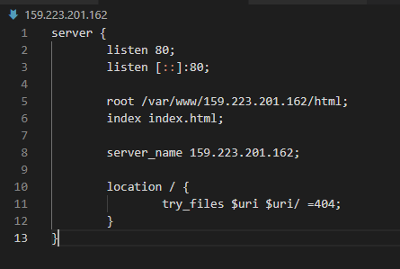
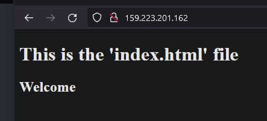
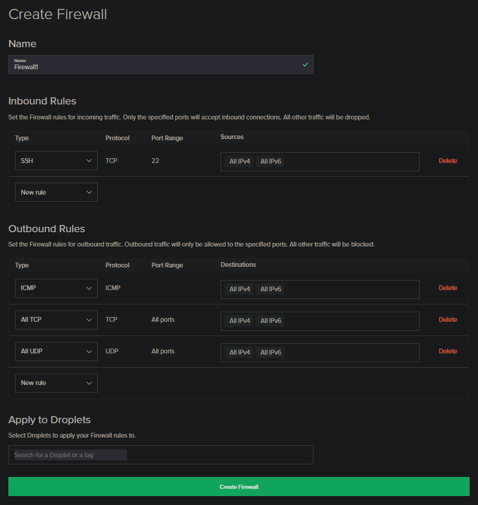
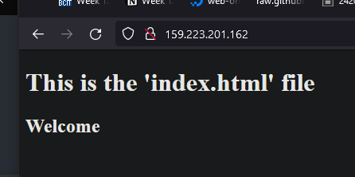

# 2420 Week 12 Lab Readme
Justin Tan
Mitchel Webb
## Usage
To set up a droplet serving a static html file with a firewall

### Part 1 - Installing NGINX
Start by running the apt install script for NGINX inside your droplet:
```
sudo apt install nginx
```

respond `y` to the prompt following that command

### Part 2 - Creating an HTML file

For the purposes of uploading to Github more easily, I've created this on my host machine and will use `sftp` to copy the file over.

Your html file should look similar to this:
```
<!DOCTYPE html>
<html lang="en">
<head>
    <meta charset="UTF-8">
    <meta http-equiv="X-UA-Compatible" content="IE=edge">
    <meta name="viewport" content="width=device-width, initial-scale=1.0">
    <title>Document</title>
</head>
<body>
    <h1>This is the 'index.html' file</h1>
    <h2>Welcome</h2>
</body>
</html>
```

Now, you'll need to run `sftp` to transfer the html file over to your droplet:
```
sftp -i [path to ssh key] [user name]@[IP address]
```

for me this command looks like this(run the command when already in the directory you have your index.html in):  


Once inside this `sftp`, type
```
put index.html
```
This will copy your index.html file from the directory you made it in to the home directory of your droplet. We need this file to be in `/var/www/[IP address]/html/` for the next step though, so first create a directory named your droplet's IP address in `/var/www/`, using
```
sudo mkdir /var/www/[IP address]
```

and then:
```
.html /var/www/[IP address]/html/
```
if this command returns permission denied, run it again preceeded by `sudo`

### Part 3 - NGINX

For this step, you're going to create an NGINX server file. 

Again for purposes of the Github repo, I'll be making this on my host machine and moving it over in the same way I moved the `index.html`

You can call your file your droplet's IP address; I'm going to call mine. The content of your file should look like this:
```
server {
        listen 80;
        listen [::]:80;

        root /var/www/[IP address]/html;
        index index.html;

        server_name [IP address];

        location / {
                try_files $uri $uri/ =404;
        }
}
```
For example, my version of this file looks like this:  



After this, if you created this file on your host machine you'll need to move the file over to your droplet using the same method I used with `sftp` in the previous step. This time however you're going to move the file into
```
/etc/nginx/sites-available/
```

The command will look like this:
```
mv [ip address] /etc/nginx/sites-available/
```
By now you should have the following:
<ul>
    <li>
        an <code>index.html</code> file in <code>/var/www/[ip address]/html/</code>
    </li>
    <li>
        a server block file in <code>/etc/nginx/sites-available/</code>
    </li>
</ul>

Now you can create the symbolic link with the command: 
<code>sudo ln -s /etc/nginx/sites-available/your_ip /etc/nginx/sites-enabled/</code>

If you want to test your nginx configuration:
<code>sudo ngnix -t</code>

Finally restart the nginx service:
<code>sudo systemctl restart nginx</code>

It should look like this:  


Now you can check to see if your html is working by typing your server ip address into your browser search bar and it should look like this:  



We ran into this error, which I don't know how, because no one else we talked to encountered it.  


But if you happen to as well you can do this:

<ol>
    <li>
        <code>cd /etc/nginx/sites-enabled/</code>
    </li>
    <li>
        You can check for the file with <code>ls -l</code>. It should show a file with the name of your ip
    </li>
    <li>
        Remove the file with <code>sudo rm [ip address]</code>
    </li>
    <li>
        Run the link command again, test the configuration if you want to, and finally restart nginx service.
    </li>
</ol>


### Part 4 - Setting Up DO Cloud Firewall

Creating a cloud firewall using Digital Ocean is done entirely in the web browser through the Digital Ocean website.

Start by finding your way to your control panel page. Left click the "Create" dropdown menu, and left click "Cloud Firewalls" from the menu:  


After that, you'll be redirected to a firewall configuration page, with a few options that we're gonna tinker with:  



As you can see above, I've named the firewall "Firewall1", but you can call yours whatever you want.

For our project, the next step is to add a new rule to Inbound Rules. Click "New rule" underneat the Inbound Rules section, and select "HTTP" from the dropdown menu. This will add a defualt configuration allowing all IPv4 and IPv6 connections:  


After that, scroll down to the "Apply to Droplets" section, and use the seach bar to find the droplet you're using for this project; we're using a droplet called "web-one":  


Then click the "Create Firewall" button, and you should be good to go!

To check if your firewall was set up properly, try reloading your page. If everything is good, it should load the exact same as it did before:  


